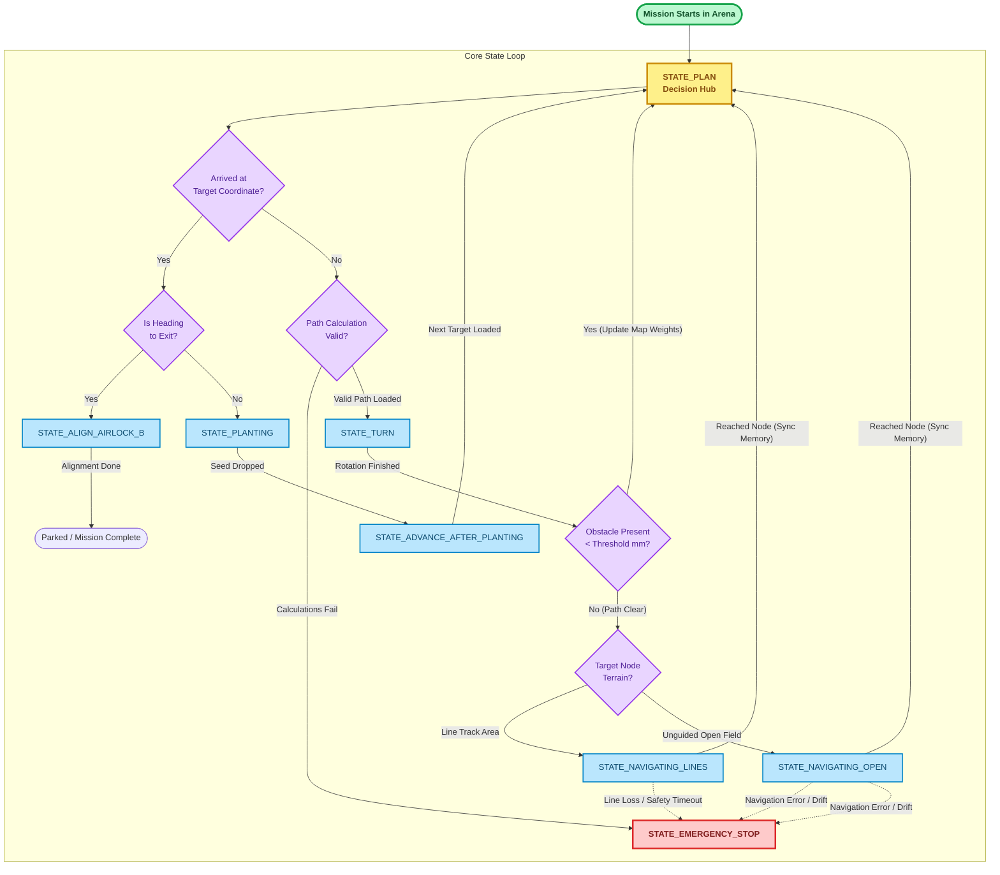

# UCL Year 1 Robotics Challenge | Team 10

[](https://www.ucl.ac.uk/)
[](https://www.arduino.cc/)
[]()

An advanced, event-driven autonomous mobile robot platform developed for the Term 3 UCL Robotics Engineering Challenge. 

## The Team
* **Kaname Asaki**
* **Yunhe Xia**
* **Zeina Hosni**
* **Maahi Patil**

---

## 📂 Repository File Architecture

```text
├── .gitignore                      # Excludes local configuration and IDE build directories
├── README.md                       # Primary project documentation and structural guides
└── arduino/                        # Master microcontroller software suite
    ├── Archive/                    # Historical testing snapshots and deprecated modules
    └── Robot_Main/                 # Production source directories (Modular multi-tab IDE project)
        ├── Communication.ino       # Manages incoming/outgoing serial telemetry commands
        ├── Hardware.ino            # Low-level driver configurations for motor channels and VCC rails
        ├── IRCalibration.ino       # Computes sensor normalization bounds for raw surface reflectivity
        ├── Navigation.ino          # Houses motion primitives, line-following loops, and steering PD logic
        ├── PathFinding.ino         # Solves global route calculations via Dijkstra grid node matrices
        ├── Robot_Main.ino          # Global framework entry point; executes setup() and core state switch
        ├── Sensors.ino             # Polling engines for active ToF fields and SPI RFID scanners
        ├── config.h                # Global calibration parameters, target speeds, and controller gains
        ├── pins.h                  # Hardwired microcontroller GPIO and interface channel mappings
        └── robot_state.h           # Defines structural enum variables representing state variables

``` 

## Core Software Architecture

The platform utilizes a customized **Event-Driven Non-Blocking State Machine** running within a high-frequency polling loop. Unlike rigid sequence-driven systems, this architecture allows the robot to continuously refresh its sensor array and listen for safety overrides simultaneously while computing real-time control adjustments.


### Core State Machine

The primary operational logic of the platform is partitioned into three key state categories within the control loop execution tree:

#### 1. Mission Logic & Navigation Control
| State Identifier | System Behavior | Mission Context |
| :--- | :--- | :--- |
| `STATE_PLAN` | **Decision Hub:** Polls coordinates, executes the Dijkstra pathfinding routing array, and updates the next sub-target node. | Core Decision Engine |
| `STATE_NAVIGATING_LINES` | **Guided Pathing:** Runs the primary line-tracking loop using PD error feedback arrays across guided sectors. | Navigate grid zone of arena |
| `STATE_NAVIGATING_OPEN` | **Unguided Pathing:** Activates IMU gyroscopic heading locks and active encoder odometry calculations to navigate open field zones. | Navigate non marked area of arena |

#### 2. Task-Specific Operations
| State Identifier | System Behavior | Mission Context |
| :--- | :--- | :--- |
| `STATE_PLANTING` | **Payload Deployment:** Suspends motion parameters completely over a node coordinate and engages the physical servo deployment system. | Activate planting mechanism |
| `STATE_RESCUE_MODE` | **Active Proximity Chase:** Deploys front-facing ToF linear distance scaling loops to decelerate toward a target vehicle, tracking path boundaries. | Revive another robot using bumper |
| `STATE_REVIVED_RETURN` | **Extraction Route:** Re-initializes wheel orientations, shifts targeting registers back to home coordinates, and begins tracking base paths. | Post-Rescue Return Sequence |
| `STATE_RAMP` | **Grade Acceleration:** Activates high-torque velocity adjustments and ultrasonic/ToF wall alignment vectors. | Navigate airlock at an incline |

#### 3. Initialisation & Hardware Fail-Safes
| State Identifier | System Behavior | Mission Context |
| :--- | :--- | :--- |
| `STATE_CALIBRATING_IR` | **Sensor Baseline:** Samples ambient track light values to map structural line-tracking reflection thresholds. | For calibration |
| `STATE_EMERGENCY_STOP` | **System Inversion Lockout:** Shuts off motor control PWM lines completely, halts clock counters, and activates blink arrays if safe bounds fail. | Main Safety Overlap |


---


## ⚙️ Electrical Subsystem Pin Mapping

The physical wiring configuration of the robot is split cleanly across functional subsystems to isolate sensory data processing from power distribution and actuator feedback.

### 1. Motor Control and Encoder Feedback
| Component / Signal | Pin / Interface | Technical Description |
| :--- | :--- | :--- |
| **Motor Controller** | `Wire1 I2C` | Motoron M3S550 serial control interface |
| **Left Motor** | `Motoron CH1` | Left drivetrain power output channel |
| **Right Motor** | `Motoron CH2` | Right drivetrain power output channel |
| **Left Encoder A** | `D2` | High-speed primary encoder interrupt input |
| **Left Encoder B** | `D3` | Secondary phase input for direction resolution |
| **Right Encoder A** | `D4` | High-speed primary encoder interrupt input |
| **Right Encoder B** | `D5` | Secondary phase input for direction resolution |

### 2. Buttons and Status Indicators
| Component / Signal | Pin / Interface | Technical Description |
| :--- | :--- | :--- |
| **Mechanical Kill Switch / Mode Button** | `D8` | Hardware push button menu input |
| **Mechanical Rescue Switch** | `D13` | Bumper collision switch (`INPUT_PULLUP`) |
| **RGB LED Red Channel** | `D52` | Blinking status indicator active when stationary |
| **RGB LED Green Channel** | `D50` | Active tracking indicator / Task 8 Rescue Success signal |
| **RGB LED Common Reference** | `GND` | Direct common ground reference line |

### 3. Sensors Array
| Component / Signal | Pin / Interface | Technical Description |
| :--- | :--- | :--- |
| **QTR Reflectance Sensor Array** | `D22–D30` | QTR S1–S9 RC timing signals for guideline positioning |
| **RFID Reader** | `Wire1 I2C` | I2C scanning module for localized node coordinate tracking |
| **TOF Sensor 1** | `Serial1` | UART hardware serial interface (Front approach tracking) |
| **TOF Sensor 2** | `Serial2` | UART hardware serial interface (Peripheral wall tracking) |
| **TOF Sensor 3** | `Serial3` | UART hardware serial interface |
| **TOF Sensor 4** | `Serial4` | UART hardware serial interface |

### 4. Power and Common Reference
| Component / Signal | Pin / Interface | Technical Description |
| :--- | :--- | :--- |
| **Lab Power Supply / Battery Input** | `Power Input` | Central high-current motor and electronics power rail |
| **Common Ground** | `GND rail` | Shared ground reference for MCU, sensors, driver, and LEDs |

> 💡 **Developer Note:** While the general schematic indicates a Common-Cathode LED configuration, certain active framework revisions utilize a Common-Anode module on pins `D50/D52`. In Common-Anode builds, pins are driven `LOW` to illuminate and `HIGH` to disable.

---


## Task-by-Task Control Flowcharts

### Task 1: Standard Line Tracking
Utilizes a high-speed Infrared (IR) reflective array paired with a **Proportional-Derivative (PD) controller** to calculate real-time differential wheel adjustments, keeping the robot centered on guidelines.


### Task 2: Intersection and Tag Alignment
Implements an event-driven intersection parsing system. When an intersection threshold is crossed, the robot scans for localized underbelly RFID tags to translate raw data into true Cartesian grid nodes.


### Task 3: Solid Grid Navigation
Combines a global pathfinding layer with localized line-following execution primitives to evaluate the map and navigate around arena grid layouts safely.


### Task 4: Open Field Dead-Reckoning
Executes precise maneuvers across track regions lacking explicit physical line guides, leveraging wheel encoder tracking and IMU yaw stability logic to minimize cumulative drift.


### Task 5: Ramped Incline/Decline Control
A dual-layer **Adaptive Cruise Control (ACC) and Proportional-Integral (PI) Velocity Controller** designed to handle steep grades. Uses active reverse-PWM engine braking downhill and dynamic torque compensation uphill while monitoring obstacle distances ahead.


### Task 8: Touch-Based Revival
A hardware-vetted rescue routine. It uses front Time-of-Flight (ToF) metrics to apply a smooth proportional deceleration curve, moving to a low-speed crawl until a physical limit switch triggers an instant motor stop, locking the state and flaring an RGB confirmation signal.


---

## Algorithms

### 1. Global Navigation & Pathfinder Optimization (Task 3)
* **Core Algorithm:** Dijkstra's Algorithm / A* Search
* **Implementation details:** `[ACTION REQUIRED: Explain briefly how your code converts the grid into a node graph, how it updates weights for obstacles, and how it triggers a recalculation loop if a path is blocked.]`

### 2. Adaptive Cruise & Anti-Windup Torque Control (Task 5)
* **Core Algorithm:** PI Velocity Control + Linear Distance Scaling
* **The Math:** Target Velocity is dynamically throttled based on the front ToF distance metric:
    $$V_{target} = V_{max} \times \left( \frac{\text{Distance}_{\text{current}} - \text{Distance}_{\text{stop}}}{\text{Distance}_{\text{detect}} - \text{Distance}_{\text{stop}}} \right)$$
* **Implementation details:** `[ACTION REQUIRED: Describe how resetting the speed integral memory to 0 during a safety stop prevents the robot from violently lunging forward when an airlock door or obstacle clears.]`

### 3. Open Field Heading-Lock Controller (Task 4 & 8 Fallback)
* **Core Algorithm:** IMU Gyro-Stabilized Heading Hold
* **Implementation details:** `[ACTION REQUIRED: Document how taking a static "snapshot" of the IMU yaw angle the millisecond the robot enters an unguided field zone prevents the robot from developing a wandering target angle, correcting wheel slippage dynamically.]`

---

